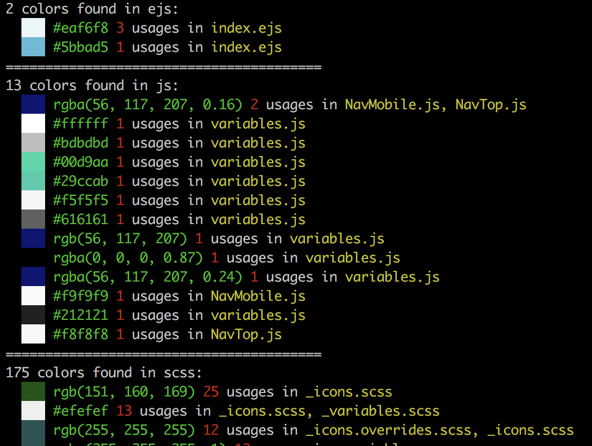

Extract colors from your source files

#### Installation

    $ npm i -g colors-in

#### Usage

    $ colors-in src/

You can include/exclude some files with `--exclude/--include` options:

    $ colors-in src/ --exclude "snap|svg" --include js

Example of the output:

Regular expressions, used for colors lookup:

    {
        hex: /#([a-f0-9]{3}|[a-f0-9]{4}(?:[a-f0-9]{2}){0,2})\b/gm,
        rgb: /rgb\(\s*(-?\d+|-?\d*\.\d+(?=%))(%?)\s*,\s*(-?\d+|-?\d*\.\d+(?=%))(\2)\s*,\s*(-?\d+|-?\d*\.\d+(?=%))(\2)\s*\)/gm,
        rgba: /rgba\(\s*(-?\d+|-?\d*\.\d+(?=%))(%?)\s*,\s*(-?\d+|-?\d*\.\d+(?=%))(\2)\s*,\s*(-?\d+|-?\d*\.\d+(?=%))(\2)\s*,\s*(-?\d+|-?\d*.\d+)\s*\)/gm
    }
